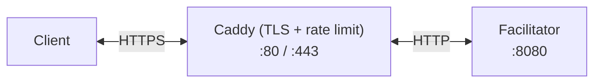

# x402 Facilitator — Deploy (1.0.0)

x402 V2 payment facilitator for on-chain verification and settlement. Default image hosts EIP-155 **exact** + **upto** and Solana **exact** (`chain-eip155,chain-solana,scheme-upto,telemetry`). Automatic HTTPS and rate limiting via Caddy.

This is **not** facilitator 0.6.0. There is no `[[schemes]]` table, no `r402-svm`, and no `GET /`. Swap the image **and** replace `config.toml` with the 1.0.0 schema. 0.6.0 config will not load.

## Architecture



- **Caddy** — Auto-HTTPS, rate limiting, security headers, request filtering. `reverse_proxy facilitator:8080` has **no** transport timeout; Axum **30 s** is the process cap on `/verify`, `/settle`, and `/supported`.
- **Facilitator** — x402 V2 `POST /verify`, `POST /settle`, `GET /supported`, plus process `GET /health`. Signer keys stay in `config.toml` / env.
- **Watchtower** — Auto-pulls new images every 5 min. Rolling restart is **off** (`WATCHTOWER_ROLLING_RESTART=false`). Image bumps stop the old container then start the new one (brief blip).

## In-memory cache (single worker)

r402 `SettlementCache` (TTL 120 s) and, if you build `scheme-batch-settlement`, `MemoryChannelStore` are **per process**. Two overlapping containers behind Caddy split both: a `/settle` that reserved in A can be replayed on B.

Do **not** enable Watchtower rolling restart. Pin `/settle` to one replica. Do not run two facilitator workers sharing one Caddy vhost.

## Prerequisites

- Linux server (Ubuntu 22.04+ / Debian 12+)
- Domain with DNS A record → server IP
- Ports **80** and **443** open

## Quick Start

```bash
git clone https://github.com/qntx/facilitator-deploy.git
cd facilitator-deploy

# 1. Configure — edit these two files:
cp config.example.toml config.toml
nano config.toml    # Add EVM / Solana signer private keys (or $VAR + env)
nano Caddyfile      # Set your domain (replace facilitator.qntx.fun)

# 2. Deploy — one command does everything:
sudo bash setup.sh

# 3. Verify (protocol + process; there is no GET /):
curl https://YOUR_DOMAIN/health
curl https://YOUR_DOMAIN/supported
```

`GET /supported` kinds must be `x402Version: 2` only. A leftover `[[schemes]]` key is a startup error — delete it.

The setup script is **idempotent** — safe to re-run after failures. It resumes from where it stopped.

```bash
sudo bash setup.sh --check    # Pre-flight checks only (no changes)
sudo bash setup.sh --force    # Redo all steps from scratch
```

## Daily Operations

After setup, use `fctl` (installed to PATH) or `make` shortcuts:

### Lifecycle

| Command | make | Description |
| --- | --- | --- |
| `fctl deploy` | `make deploy` | Pull latest images + recreate containers + health check |
| `fctl reload` | `make reload` | Smart reload — auto-detects which config changed |
| `fctl update` | `make update` | Pull latest Docker images + recreate (stop-then-start) |

### Observability

| Command | make | Description |
| --- | --- | --- |
| `fctl status` | `make status` | Dashboard: service status, health, image versions |
| `fctl doctor` | `make doctor` | Full diagnostics (ports, DNS, TLS, disk, health) |
| `fctl logs` | `make logs` | Follow facilitator logs |
| `fctl logs caddy` | `make logs-caddy` | Follow Caddy logs |
| `fctl logs watchtower` | `make logs-watchtower` | Follow Watchtower logs |
| `fctl logs all` | `make logs-all` | Follow all service logs |

### Configuration

| Command | make | Description |
| --- | --- | --- |
| `fctl edit config` | `make edit-config` | Auto-backup → edit → smart reload |
| `fctl edit caddy` | `make edit-caddy` | Auto-backup → edit → smart reload |
| `fctl backup` | `make backup` | Backup all config files (keeps last 10) |
| `fctl restore <ts>` | — | Restore config from backup timestamp |

### Maintenance

| Command | make | Description |
| --- | --- | --- |
| `fctl reset` | `make reset` | Stop all + remove volumes (destructive, requires confirmation) |
| `fctl purge` | `make purge` | Force-remove ALL x402-* containers/volumes/networks |
| — | `make prune` | Remove dangling Docker images |

## Common Workflows

### Config changed → reload

```bash
nano config.toml           # Make changes
fctl reload                # Auto-detects config.toml changed → restarts only facilitator
```

### Update Docker images manually

```bash
fctl update                # Pulls latest facilitator → recreate (stop-then-start) → health check
```

> Watchtower also auto-updates every 5 minutes (stop-then-start, not rolling). Manual update is only needed for immediate updates.

### Something broken → diagnose

```bash
fctl doctor                # Checks: Docker, disk, ports, containers, health, TLS
fctl logs                  # View facilitator logs
fctl logs all              # View all service logs
```

### Config broken → rollback

```bash
fctl backup                # List available backups
fctl restore 20260213-160000
fctl deploy                # Apply restored config
```

A 1.0.0 V2 client cannot roll back to a 0.6.0 / r402 0.15.0 image. Restore previous **product**, not a compatible downgrade.

## Configuration Reference

### `config.toml` — Signer Keys & Chains

1.0.0 schema. No `[[schemes]]`. Schemes come from the image Cargo features.

```toml
host = "0.0.0.0"
port = 8080
log_level = "info"

[signers]
evm = ["$EVM_SIGNER_PRIVATE_KEY"]       # hex, 0x-prefixed
solana = "$SOLANA_SIGNER_PRIVATE_KEY"    # base58, 64-byte keypair

[chains."eip155:84532"]
rpc = [{ http = "https://sepolia.base.org" }]
receipt_timeout_secs = 20

[chains."solana:EtWTRABZaYq6iMfeYKouRu166VU2xqa1"]
rpc = "https://api.devnet.solana.com"
```

`receipt_timeout_secs` defaults to **20** and must stay below the **30 s** HTTP / client timeout. Operators who need longer waits raise client `timeoutMs`, process HTTP timeout, and `receipt_timeout_secs` together.

> **RPC tip:** Do NOT use free public RPCs in production. Use [Alchemy](https://alchemy.com), [QuickNode](https://quicknode.com), [dRPC](https://drpc.org), or [Helius](https://helius.dev) (Solana).

### `Caddyfile` — Domain & TLS

Replace `facilitator.qntx.fun` with your domain. Everything else is pre-configured (auto-TLS, rate limiting, security headers). Do not add a `reverse_proxy` transport timeout unless it is strictly above 30 s + margin.

## Security Notes

- Facilitator binds to `127.0.0.1:8080` — **not** exposed to the internet
- Only Caddy (80/443) is publicly accessible
- `config.toml` is `chmod 644` and gitignored
- Recommended firewall: `ufw allow 80,443/tcp && ufw deny 8080`

## Cloudflare (Optional)

If using Cloudflare proxy:

1. Set SSL/TLS mode to **Full (strict)**
2. Enable **Always Use HTTPS**
3. Restrict firewall to [Cloudflare IP ranges](https://www.cloudflare.com/ips/) only
